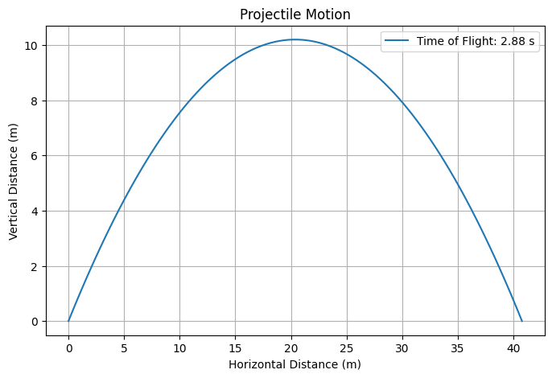
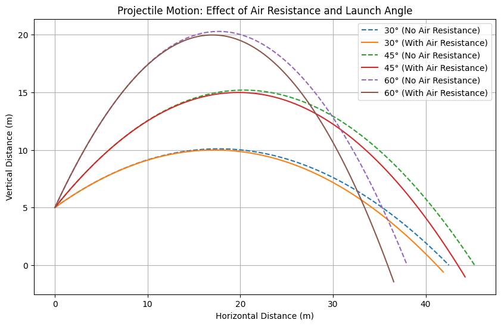

# Problem 1
# Investigating the Range as a Function of the Angle of Projection

## Motivation
Projectile motion is a classic problem in physics that elegantly combines kinematics and dynamics to describe the trajectory of objects under the influence of gravity. The question of how the horizontal range depends on the angle of projection is both simple and profound, revealing a rich interplay of initial conditions and physical parameters. This investigation explores the theoretical underpinnings, parametric dependencies, and real-world applications of projectile motion, enhanced by computational simulation.

---

## 1. Theoretical Foundation

### Deriving the Governing Equations
Projectile motion occurs in two dimensions under constant gravitational acceleration, assuming no air resistance. Let’s derive the equations from Newton’s second law.

- **Horizontal motion**: No forces act in the x-direction (assuming no drag), so acceleration $ a_x = 0 $.
  $
  \frac{d^2x}{dt^2} = 0 \quad \Rightarrow \quad v_x = v_0 \cos\theta = \text{constant}
  $
  Integrating:
  $
  x(t) = v_0 \cos\theta \cdot t + x_0
  $
  With $ x_0 = 0 $ (launch from origin):
  $
  x(t) = v_0 \cos\theta \cdot t
  $

- **Vertical motion**: The only force is gravity, $ a_y = -g $.
  $
  \frac{d^2y}{dt^2} = -g
  $
  Integrating once:
  $
  v_y = \frac{dy}{dt} = -gt + v_{y0} = -gt + v_0 \sin\theta
  $
  Integrating again (with $ y_0 = 0 $ for simplicity):
  $
  y(t) = v_0 ($sin\theta \cdot t - \frac{1}{2} g t^2
  $

### Time of Flight
The projectile hits the ground when $ y(t) = 0 $:
$
v_0 \sin\theta \cdot t - \frac{1}{2} g t^2 = 0
$
Factorizing:
$
t \left( v_0 \sin\theta - \frac{1}{2} g t \right) = 0
$
Solutions: $ t = 0 $ (launch) or:
$
t = \frac{2 v_0 \sin\theta}{g}
$
This is the time of flight, $ T $.

### Range Equation
The horizontal range $ R $ is the distance traveled when $ t = T $:
$
R = x(T) = v_0 \cos\theta \cdot \frac{2 v_0 \sin\theta}{g}
$
Using the trigonometric identity $ \sin 2\theta = 2 \sin\theta \cos\theta $:
$
R = \frac{v_0^2 \sin 2\theta}{g}
$

### Family of Solutions
The range depends on:
- $ v_0 $ (initial velocity): Quadratic dependence ($ R \propto v_0^2 $).
- $ \theta $ (angle of projection): Sinusoidal dependence via $ \sin 2\theta $.
- $ g $ (gravitational acceleration): Inverse dependence ($ R \propto 1/g $).
This parametric flexibility generates a family of solutions, adaptable to different scenarios.

---

## 2. Analysis of the Range

### Dependence on Angle of Projection
- The term $ \sin 2\theta $ reaches a maximum of 1 when $ 2\theta = 90^\circ $, or $ \theta = 45^\circ $.
- Thus, the maximum range is:
  $
  R_{\text{max}} = \frac{v_0^2}{g} \quad \text{at} \quad \theta = 45^\circ
  $
- For $ \theta < 45^\circ $ or $ \theta > 45^\circ $, the range decreases symmetrically (e.g., $ \theta = 30^\circ $ and $ 60^\circ $ yield the same range).

### Influence of Other Parameters
- **Initial Velocity ($ v_0 $)**: Doubling $ v_0 $ quadruples the range, reflecting the $ v_0^2 $ term.
- **Gravitational Acceleration ($ g $)**: On the Moon ($ g \approx 1.62 \, \text{m/s}^2 $), the range is about 6 times greater than on Earth ($ g \approx 9.81 \, \text{m/s}^2 $), for the same $ v_0 $ and $ \theta $.

---

## 3. Practical Applications

### Real-World Scenarios
- **Sports**: The trajectory of a soccer ball or golf ball follows this model, with optimal angles near 45° for maximum distance (adjusted slightly by air resistance).
- **Engineering**: Artillery and rocket launches use these principles, often with corrections for drag and wind.
- **Uneven Terrain**: If launched from height $ h $, the time of flight extends, modifying the range:
  $
  T = \frac{v_0 \sin\theta + \sqrt{(v_0 \sin\theta)^2 + 2gh}}{g}
  $
  $
  R = v_0 \cos\theta \cdot T
  $
- **Air Resistance**: Introduces a damping term, reducing range and altering the optimal angle (typically < 45°).

---

# Constants
g = 9.81  # acceleration due to gravity (m/s^2)

# Function to calculate range of a projectile
def calculate_range(v0, theta_deg):
    theta_rad = np.radians(theta_deg)  # Convert degrees to radians
    range = (v0**2 * np.sin(2 * theta_rad)) / g
    return range

# Angles from 0 to 90 degrees
angles = np.arange(0, 91, 1)

# Different initial velocities (m/s)
initial_velocities = [10, 20, 30, 40]

# Plotting
plt.figure(figsize=(10, 6))
for v0 in initial_velocities:
    ranges = [calculate_range(v0, theta) for theta in angles]
    plt.plot(angles, ranges, label=f'v0 = {v0} m/s')

# Customize the plot
plt.title('Projectile Range vs. Angle of Projection')
plt.xlabel('Angle of Projection (degrees)')
plt.ylabel('Range (meters