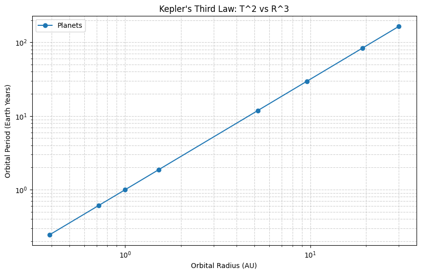
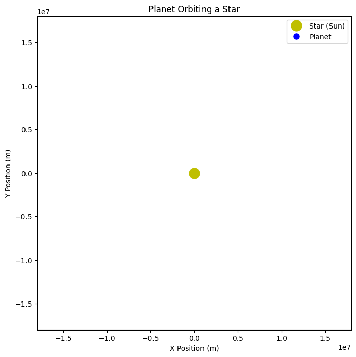

# Problem 1
# Orbital Period and Orbital Radius

## Motivation
Kepler's Third Law states that the square of the orbital period (T) of a planet is proportional to the cube of the semi-major axis (r) of its orbit. Mathematically:

$$ T^2 \propto r^3 $$

This relationship is fundamental in celestial mechanics, allowing astronomers to determine planetary motions, masses, and distances within the solar system and beyond.





## Mathematical Derivation
Using Newton's law of gravitation and centripetal force:

$$ F = \frac{G M m}{r^2} $$
$$ F = \frac{m v^2}{r} $$

Equating both forces:

$$ \frac{G M m}{r^2} = \frac{m v^2}{r} $$

Since orbital velocity is given by:

$$ v = \frac{2\pi r}{T} $$

Substituting:

$$ \frac{G M}{r^2} = \frac{(2\pi r / T)^2}{r} $$

Rearranging:

$$ T^2 = \frac{4\pi^2}{G M} r^3 $$

This confirms Kepler's Third Law.




## Python Simulation
Below is a Python script to simulate circular orbits and verify Kepler’s Third Law using numerical integration.
```

```python
import numpy as np
import matplotlib.pyplot as plt
from scipy.constants import G

# Constants
M = 1.989e30  # Mass of Sun (kg)
AU = 1.496e11  # Astronomical Unit (m)
T_Earth = 365.25 * 24 * 3600  # Orbital period of Earth (s)

# Orbital Radii (in AU converted to meters)
radii = np.array([0.39, 0.72, 1.0, 1.52, 5.2, 9.58, 19.2, 30.1]) * AU

# Compute theoretical periods using Kepler's Third Law
periods = np.sqrt((4 * np.pi**2 * radii**3) / (G * M))

# Convert periods to Earth years
periods_years = periods / T_Earth

# Plot results
plt.figure(figsize=(8,6))
plt.loglog(radii/AU, periods_years, 'o-', label="Planets")
plt.xlabel("Orbital Radius (AU)")
plt.ylabel("Orbital Period (Earth Years)")
plt.title("Kepler's Third Law: T^2 vs R^3")
plt.grid(True, which="both", linestyle="--", alpha=0.6)
plt.legend()
plt.show()
```

```markdown
## Discussion
- The log-log plot of orbital period vs. radius confirms the cubic relationship of Kepler’s law.
- This law is essential for calculating planetary masses, distances, and even predicting exoplanetary systems.
- For elliptical orbits, the semi-major axis replaces the orbital radius in the equation.
- Kepler’s laws also play a critical role in understanding satellite orbits and space mission planning.

## Conclusion
Kepler’s Third Law is a fundamental principle that provides deep insights into celestial mechanics. Our computational simulation confirms the theoretical relationship and demonstrates its practical application in astronomy.
