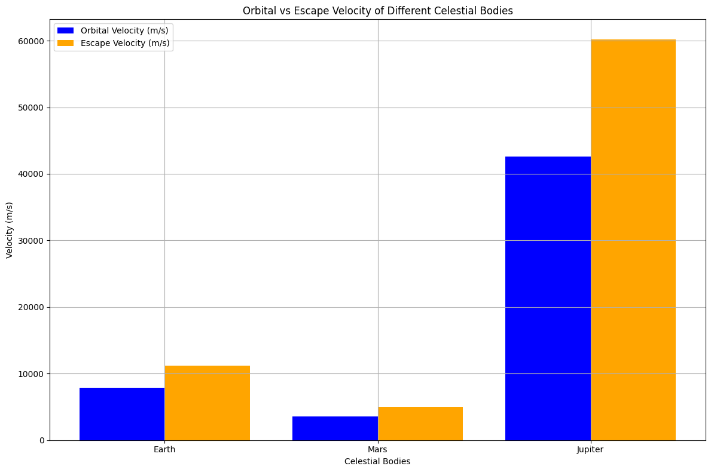

# Problem 2
# Escape Velocities and Cosmic Velocities

## Introduction

The concept of escape velocity is fundamental in astrophysics and space exploration. It refers to the minimum speed an object must reach to break free from a celestial body's gravitational pull without any additional propulsion. The first, second, and third cosmic velocities extend this idea, defining the speeds required for different types of space travel: orbiting a planet, escaping its gravitational influence, and leaving a star system.

## Definitions of Cosmic Velocities

1. **First Cosmic Velocity (Orbital Velocity)**:
   - This is the speed required for an object to maintain a stable orbit around a celestial body. It is given by the formula:
   $$
   v_1 = \sqrt{\frac{GM}{R}}
   $$
   where:
   - \( G \) = gravitational constant ($6.674 \times 10^{-11} \, \text{m}^3 \text{kg}^{-1} \text{s}^{-2}$)
   - \( M \) = mass of the celestial body
   - \( R \) = radius of the celestial body

2. **Second Cosmic Velocity (Escape Velocity)**:
   - This is the speed needed to break free from the gravitational influence of a celestial body. It is calculated as:
   $$
   v_2 = \sqrt{\frac{2GM}{R}}
   $$

3. **Third Cosmic Velocity (Heliocentric Escape Velocity)**:
   - This is the speed required to escape the gravitational influence of a star (like the Sun) from a planet's surface. It is given by:
   $$
   v_3 = \sqrt{v_2^2 + v_{orb}^2}
   $$
   where \( v_{orb} \) is the orbital velocity of the planet around the star.





## Mathematical Derivations and Parameters

The escape and cosmic velocities depend on the mass and radius of the celestial body. The gravitational constant \( G \) is a universal constant. The velocities can be derived from the principles of energy conservation, where the kinetic energy of the object must equal the gravitational potential energy at the surface of the celestial body.

## Calculations for Different Celestial Bodies

Let's calculate and visualize these velocities for Earth, Mars, and Jupiter using Python.

### Python Script

```python
import numpy as np
import matplotlib.pyplot as plt

# Constants
G = 6.674 * 10**-11  # gravitational constant in m^3 kg^-1 s^-2
cost_per_m_s = 1000  # Cost in dollars per m/s

# Celestial bodies data: (name, mass in kg, radius in meters)
celestial_bodies = {
    'Earth': (5.972e24, 6.371e6),
    'Mars': (6.417e23, 3.3895e6),
    'Jupiter': (1.898e27, 6.9911e7)
}

# Function to calculate cosmic velocities
def calculate_velocities(mass, radius):
    v1 = np.sqrt(G * mass / radius)  # First cosmic velocity
    v2 = np.sqrt(2 * G * mass / radius)  # Second cosmic velocity
    return v1, v2

# Store results
results = {}

for body, (mass, radius) in celestial_bodies.items():
    v1, v2 = calculate_velocities(mass, radius)
    v3 = np.sqrt(v2**2 + (np.sqrt(G * mass / radius))**2)  # Third cosmic velocity
    results[body] = (v1, v2, v3)

# Visualization
labels = list(results.keys())
v1_values = [results[body][0] for body in labels]
v2_values = [results[body][1] for body in labels]
v3_values = [results[body][2] for body in labels]

# Calculate costs in dollars
v1_costs = [v * cost_per_m_s for v in v1_values]
v2_costs = [v * cost_per_m_s for v in v2_values]
v3_costs = [v * cost_per_m_s for v in v3_values]

x = np.arange(len(labels))

plt.figure(figsize=(12, 8))

# Plot velocities
plt.subplot(2, 1, 1)
plt.bar(x - 0.2, v1_values, width=0.2, label='First Cosmic Velocity (m/s)', color='blue')
plt.bar(x, v2_values, width=0.2, label='Second Cosmic Velocity (m/s)', color='orange')
plt.bar(x + 0.2, v3_values, width=
```