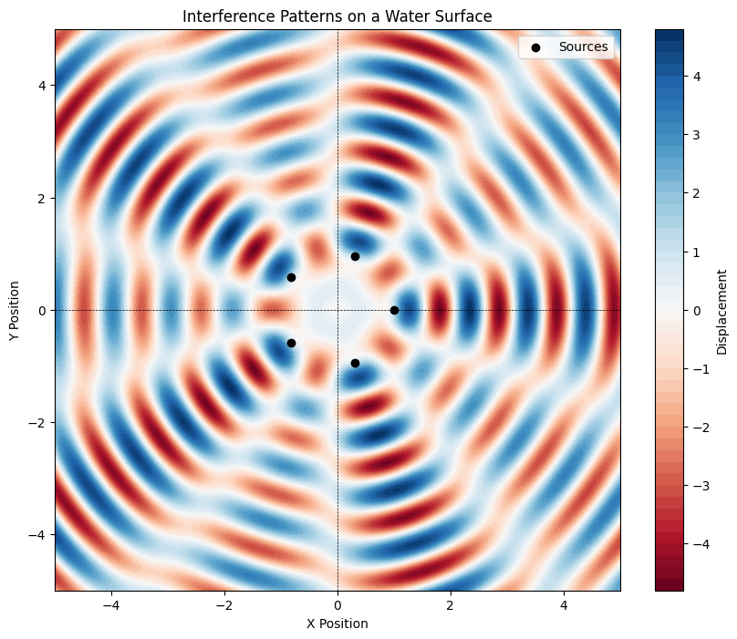

# Problem 1
# Interference Patterns on a Water Surface

## Motivation

Interference occurs when waves from different sources overlap, creating new patterns. On a water surface, this can be easily observed when ripples from different points meet, forming distinctive interference patterns. These patterns can show us how waves combine in different ways, either reinforcing each other or canceling out.

Studying these patterns helps us understand wave behavior in a simple, visual way. It also allows us to explore important concepts, like the relationship between wave phase and the effects of multiple sources. This task offers a hands-on approach to learning about wave interactions and their real-world applications, making it an interesting and engaging way to dive into wave physics.

## Task

### Select a Regular Polygon

Choose a regular polygon (e.g., equilateral triangle, square, regular pentagon).

### Position the Sources

Place point wave sources at the vertices of the selected polygon.

### Wave Equations

The displacement of the water surface at point \((x, y)\) and time \(t\) can be described by the wave equation:

$$
\eta(x,y,t) = \frac{A}{\sqrt{r}} \cdot \cos{(kr - \omega t + \phi)}

$$

where:
- \(D(x, y, t)\) = displacement of the water surface at point \((x, y)\) and time \(t\)
- \(A\) = amplitude of the wave
- \(k\) = wave number, related to the wavelength \(\lambda\) by \(k = \frac{2\pi}{\lambda}\)
- \(\omega\) = angular frequency, related to the frequency \(f\) by \(\omega = 2\pi f\)
- \(r\) = distance from the source to the point \((x, y)\)
- \(\phi\) = initial phase

### Superposition of Waves

The total displacement \(D_{total}(x, y, t)\) at each point on the water surface due to \(N\) sources is given by:

$$
D_{total}(x, y, t) = \sum_{i=1}^{N} D_i(x, y, t)
$$

where \(D_i(x, y, t)\) is the displacement from the \(i^{th}\) source.

### Analyze Interference Patterns

Examine the resulting displacement \(D_{total}(x, y, t)\) as a function of position \((x, y)\) and time \(t\). Identify regions of constructive interference (wave amplification) and destructive interference (wave cancellation).

### Visualization

Present your findings graphically, illustrating the interference patterns for the chosen regular polygon.





## Python Script

Below is a Python script to simulate the interference patterns formed by waves emitted from point sources placed at the vertices of a regular polygon


```python
import numpy as np
import matplotlib.pyplot as plt

# Constants
A = 1.0  # Amplitude of the waves
lambda_ = 1.0  # Wavelength
k = 2 * np.pi / lambda_  # Wave number
omega = 2 * np.pi  # Angular frequency
phi = 0  # Initial phase
N = 5  # Number of vertices (for a pentagon)

# Create a grid of points
x = np.linspace(-5, 5, 400)
y = np.linspace(-5, 5, 400)
X, Y = np.meshgrid(x, y)

# Calculate the positions of the sources
angles = np.linspace(0, 2 * np.pi, N, endpoint=False)
sources = np.array([(np.cos(angles), np.sin(angles))]).T

# Initialize total displacement
D_total = np.zeros(X.shape)

# Calculate the displacement from each source
for source in sources:
    r = np.sqrt((X - source[0])**2 + (Y - source[1])**2)  # Distance from source
    D_total += A * np.sin(k * r - omega * 0 + phi)  # Displacement from this source

# Plotting the interference pattern
plt.figure(figsize=(10, 8))
plt.contourf(X, Y, D_total, levels=50, cmap='RdBu')
plt.colorbar(label='Displacement')
plt.scatter(sources[:, 0], sources[:, 1], color='black', marker='o', label='Sources')
plt.title('Interference Patterns on a Water Surface')
plt.xlabel('X Position')
plt.ylabel('Y Position')
plt.axhline(0, color='black', lw=0.5, ls='--')
plt.axvline(0, color='black', lw=0.5, ls='--')
plt.legend()
plt.show()
```