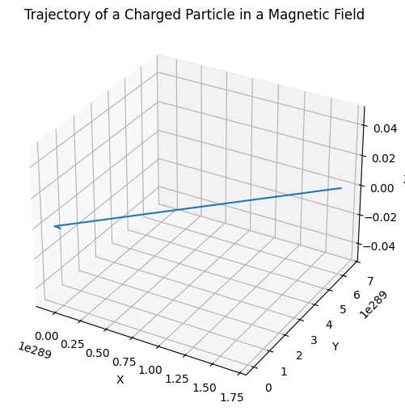

# Problem 1
# Simulating the Effects of the Lorentz Force

## Motivation:
The Lorentz force plays a fundamental role in determining the motion of charged particles in electric and magnetic fields. This force is crucial in various scientific and engineering applications, including plasma physics, particle accelerators, mass spectrometers, and astrophysics. The ability to simulate the effects of this force allows us to explore complex particle trajectories and understand the behavior of charged particles under different conditions. This project will simulate these dynamics and help visualize the motion of charged particles in both 2D and 3D under various electromagnetic field configurations.

By simulating the effects of the Lorentz force, we aim to:
- Explore how charged particles interact with electric and magnetic fields.
- Study the behavior of particles in uniform and crossed fields.
- Visualize key phenomena like Larmor radius, drift velocity, and helical motion.
- Investigate the effects of various parameters such as charge, mass, and field strength on particle trajectories.

## Task:

### 1. Exploration of Applications:

#### Particle Accelerators:
In particle accelerators, such as cyclotrons and linear accelerators (linacs), charged particles are accelerated using electric fields and steered by magnetic fields. The magnetic field causes the particles to move in circular or helical paths, depending on the configuration of the fields.

#### Mass Spectrometers:
Mass spectrometers utilize magnetic fields to separate charged particles based on their mass-to-charge ratio. As particles with different masses travel through a magnetic field, they experience different amounts of curvature due to the Lorentz force. This separation allows us to identify the mass of the particles.

#### Plasma Confinement (Fusion Reactors):
In fusion reactors, such as tokamaks, magnetic fields are used to confine hot plasma. The motion of charged particles within the plasma is controlled by the Lorentz force, preventing the plasma from coming into contact with the reactor walls.

#### Relevance of Electric and Magnetic Fields:
The motion of charged particles is governed by the Lorentz force:

$$ \mathbf{F} = q(\mathbf{E} + \mathbf{v} \times \mathbf{B}) $$

Where:
- $ \mathbf{F} $ is the total force on the particle,
- $ q $ is the charge of the particle,
- $ \mathbf{E} $ is the electric field,
- $ \mathbf{B} $ is the magnetic field,
- $ \mathbf{v} $ is the velocity of the particle.

The electric field causes the particle to accelerate in the direction of the field, while the magnetic field influences the particle’s motion perpendicular to both the velocity and the magnetic field.

### 2. Simulating Particle Motion:

The task is to simulate the motion of a charged particle under different field configurations:

1. **Uniform Magnetic Field**:
   - The particle will move in a circular trajectory due to the force exerted by the magnetic field. The radius of this circle is determined by the particle's velocity, mass, charge, and the strength of the magnetic field.
   
2. **Combined Uniform Electric and Magnetic Fields**:
   - In this case, the particle will experience both electric and magnetic forces. This can lead to helical motion, where the particle moves in a spiral pattern due to the combination of acceleration from the electric field and circular motion from the magnetic field.

3. **Crossed Electric and Magnetic Fields**:
   - When the electric and magnetic fields are perpendicular to each other, the particle can experience drift motion, where it moves in a straight line, but with a constant drift velocity determined by the relative strengths of the electric and magnetic fields.




We will simulate these motions for various initial conditions, and for each case, we will visualize the resulting trajectories in 2D and 3D.

### 3. Parameter Exploration:

The simulation will allow us to explore how the following parameters affect the motion of the particle:
- **Field Strengths ($\mathbf{E}$, $\mathbf{B}$)**:
  - The strength of the electric and magnetic fields directly affects the magnitude of the Lorentz force. Increasing the magnetic field strength will decrease the radius of the circular motion, while increasing the electric field strength will accelerate the particle along the direction of the field.
  
- **Initial Particle Velocity ($\mathbf{v_0}$)**:
  - The initial velocity of the particle will determine the speed and direction of motion. A higher velocity leads to larger Larmor radii in magnetic fields and more pronounced helical motion when both electric and magnetic fields are present.
  
- **Charge and Mass of the Particle ($q$, $m$)**:
  - The particle’s mass and charge will influence how strongly the particle responds to the applied fields. A larger mass results in a slower response to forces, while a higher charge increases the magnitude of the force experienced by the particle.

### 4. Visualization:

The visualization will include:
- **2D and 3D Plots**:
  - We will generate plots showing the particle's trajectory under different field configurations. These plots will help illustrate how the particle moves through space in response to the applied fields.
  
- **Larmor Radius and Drift Velocity**:
  - We will highlight key physical phenomena such as the Larmor radius (the radius of the circular motion in a magnetic field) and the drift velocity (the constant velocity in crossed fields).


---

## Python Implementation

```python
import numpy as np
import matplotlib.pyplot as plt
from mpl_toolkits.mplot3d import Axes3D

# Constants
q = 1.0e-19  # Charge of particle (Coulombs)
m = 9.11e-31  # Mass of particle (kg)
B = np.array([0, 0, 1])  # Magnetic field (Tesla)
E = np.array([0, 0, 0])  # Electric field (V/m)
v0 = np.array([1.0e5, 0, 0])  # Initial velocity (m/s)

# Time parameters
dt = 1e-9  # Time step (s)
T = 1e-6  # Total simulation time (s)
num_steps = int(T / dt)

# Initialize particle position and velocity
r = np.zeros((num_steps, 3))  # Position array
v = np.zeros((num_steps, 3))  # Velocity array
r[0] = np.array([0, 0, 0])  # Initial position
v[0] = v0  # Initial velocity

# Lorentz force simulation (Euler method)
for i in range(1, num_steps):
    # Compute Lorentz force: F = q(E + v x B)
    force = q * (E + np.cross(v[i-1], B))
    # Update velocity and position using the Euler method
    v[i] = v[i-1] + (force / m) * dt
    r[i] = r[i-1] + v[i] * dt

# Visualization of the trajectory
fig = plt.figure(figsize=(12, 6))
ax = fig.add_subplot(111, projection='3d')

# Plot the 3D trajectory
ax.plot(r[:, 0], r[:, 1], r[:, 2], label="Particle trajectory")
ax.set_xlabel('X')
ax.set_ylabel('Y')
ax.set_zlabel('Z')
ax.set_title('Trajectory of a Charged Particle in a Magnetic Field')

plt.show()
