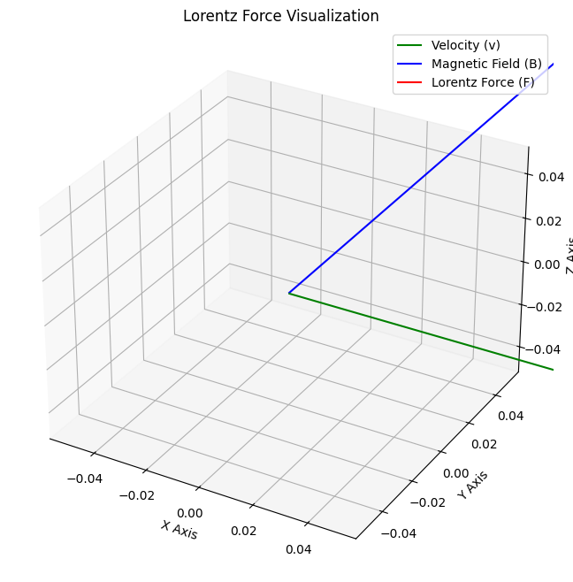
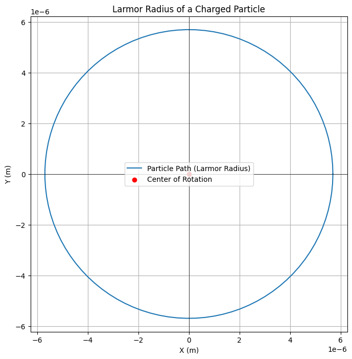

# Problem 1
# Simulating the Effects of the Lorentz Force

## Motivation:
The Lorentz force governs the motion of charged particles in electric and magnetic fields. It is foundational in fields like plasma physics, particle accelerators, and astrophysics. By simulating the motion of charged particles, we can explore the practical applications and visualize the complex trajectories that arise due to these forces.

## Lorentz Force Equation

The Lorentz force experienced by a particle is given by the following equation:

$$
\mathbf{F} = q (\mathbf{E} + \mathbf{v} \times \mathbf{B})
$$

Where:
- \( \mathbf{F} \) is the total force on the particle (N)
- \( q \) is the charge of the particle (C)
- \( \mathbf{E} \) is the electric field (V/m)
- \( \mathbf{B} \) is the magnetic field (Tesla)
- \( \mathbf{v} \) is the velocity of the particle (m/s)

### Motion Equation

The motion of the particle can be derived from Newton's second law:

$$
\mathbf{F} = m \cdot \mathbf{a} \quad \Rightarrow \quad m \cdot \frac{d\mathbf{v}}{dt} = q (\mathbf{E} + \mathbf{v} \times \mathbf{B})
$$




Where:
- \( m \) is the mass of the particle (kg)
- \( \mathbf{a} \) is the acceleration (m/s²)

This equation is used to compute the velocity and position of the particle iteratively over time.

### Larmor Radius

In the presence of a magnetic field, the particle undergoes circular motion. The radius of this circular motion is called the Larmor radius:

$$
r_L = \frac{m v_{\perp}}{q B}
$$

Where:
- \( r_L \) is the Larmor radius (m)
- \( v_{\perp} \) is the velocity component perpendicular to the magnetic field (m/s)
- \( B \) is the magnetic field strength (Tesla)




x   

## Python Simulation

### Code Implementation:

This simulation will calculate the trajectory of a charged particle under the influence of both electric and magnetic fields. The code uses the Euler method to update the velocity and position of the particle at each time step.

```python
import numpy as np
import matplotlib.pyplot as plt
from mpl_toolkits.mplot3d import Axes3D

# Constants
q = 1.0e-19  # Particle charge in Coulombs
m = 9.11e-31  # Particle mass in kg
E = np.array([0, 0, 0])  # Electric field in V/m, initially no electric field
B = np.array([0, 0, 1])  # Magnetic field in Tesla (along Z-axis)
v0 = np.array([1.0e5, 0, 0])  # Initial velocity in m/s along X-axis

# Time parameters
dt = 1e-9  # Time step in seconds
T = 1e-6  # Total simulation time in seconds
num_steps = int(T / dt)  # Number of time steps

# Initialize position and velocity arrays
r = np.zeros((num_steps, 3))  # Position array (x, y, z)
v = np.zeros((num_steps, 3))  # Velocity array (vx, vy, vz)
r[0] = np.array([0, 0, 0])  # Initial position at origin
v[0] = v0  # Initial velocity

# Simulation loop (Euler method)
for i in range(1, num_steps):
    # Lorentz force: F = q(E + v x B)
    force = q * (E + np.cross(v[i-1], B))  # Total force (electric + magnetic)
    # Update velocity and position using the Euler method
    v[i] = v[i-1] + (force / m) * dt
    r[i] = r[i-1] + v[i] * dt

# Plotting the trajectory in 2D
plt.figure(figsize=(10, 6))
plt.plot(r[:, 0], r[:, 1], label="Particle trajectory")
plt.xlabel('X Position (m)')
plt.ylabel('Y Position (m)')
plt.title('Trajectory of a Charged Particle in Electric and Magnetic Fields')
plt.axhline(0, color='black', linewidth=1)
plt.axvline(0, color='black', linewidth=1)
plt.grid(True)
plt.legend()
plt.show()

# Plotting the trajectory in 3D
fig = plt.figure(figsize=(12, 8))
ax = fig.add_subplot(111, projection='3d')
ax.plot(r[:, 0], r[:, 1], r[:, 2], label="Particle trajectory")
ax.set_xlabel('X Position (m)')
ax.set_ylabel('Y Position (m)')
ax.set_zlabel('Z Position (m)')
ax.set_title('3D Trajectory of a Charged Particle')
ax.grid(True)
ax.legend()
plt.show()
```

