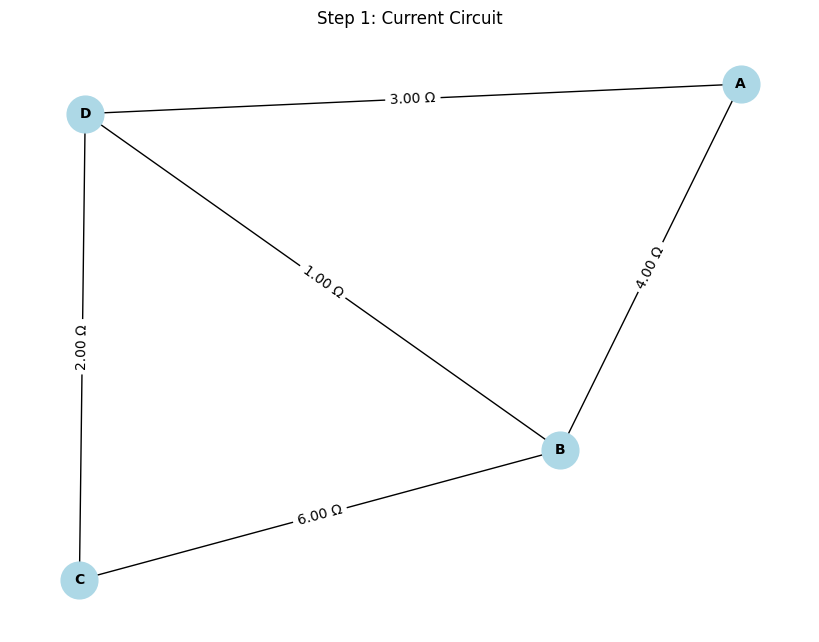
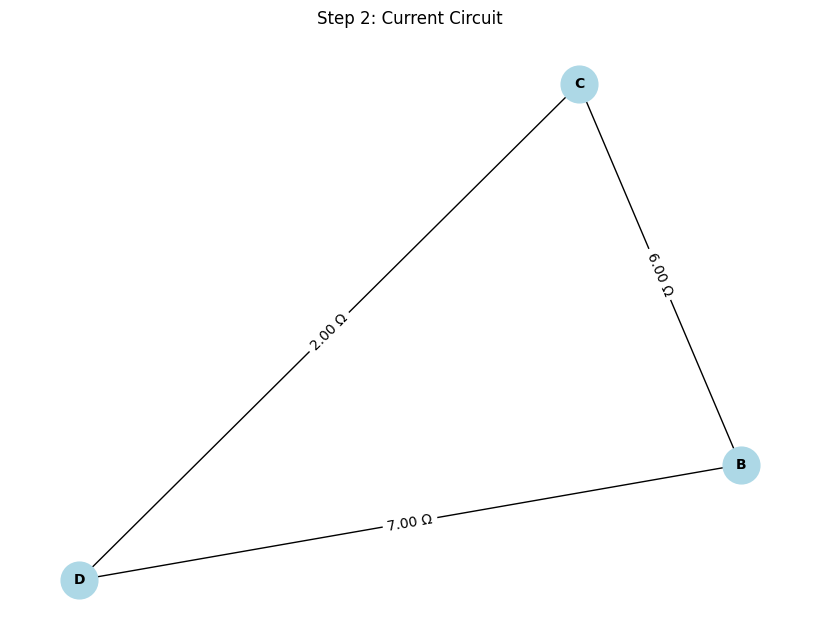
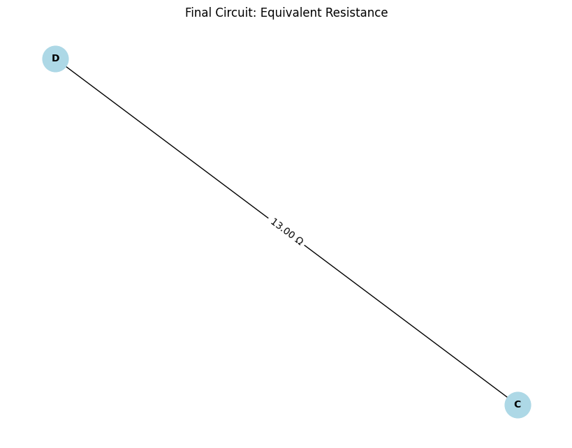

# Problem 1
# Equivalent Resistance Calculation Using Graph Theory
Calculating equivalent resistance is a key problem in electrical circuit analysis, essential for designing and optimizing efficient systems. While traditional methods rely on iterative applications of series and parallel resistor rules, these approaches can become unwieldy when dealing with complex circuits that involve numerous components. Graph theory provides a robust and algorithmic alternative, enabling the systematic simplification of even the most intricate networks.

By modeling a circuit as a graph—where nodes represent junctions and edges represent resistors with weights corresponding to their resistance values—we can streamline the analysis of complex circuits. This approach not only simplifies calculations but also opens the door to automated analysis, making it particularly valuable in modern applications such as circuit simulation software, optimization problems, and network design.

Studying equivalent resistance through the lens of graph theory offers practical advantages and provides a deeper understanding of the intricate relationship between electrical and mathematical concepts. This approach showcases the versatility of graph theory, highlighting its relevance across various fields, including physics, engineering, and computer science.
## Option 1: Simplified Task – Algorithm Description

### Algorithm Description

1.  **Graph Representation:**
    * Represent the electrical circuit as a graph $G = (V, E)$, where:
        * $V$ is the set of nodes (junctions).
        * $E$ is the set of edges (resistors).
        * Each edge $e \in E$ has a weight $R_e$ representing the resistance.
2.  **Series Reduction:**
    * Identify linear chains of nodes with degree 2.
    * Combine the resistances of the series edges into a single equivalent resistance: $R_{eq} = R_1 + R_2 + ... + R_n$.
    * Replace the series chain with a single edge having the equivalent resistance.
3.  **Parallel Reduction:**
    * Identify parallel edges between two nodes.
    * Combine the resistances of the parallel edges into a single equivalent resistance: $R_{eq} = \frac{1}{\frac{1}{R_1} + \frac{1}{R_2} + ... + \frac{1}{R_n}}$.
    * Replace the parallel edges with a single edge having the equivalent resistance.
4.  **Iteration:**
    * Repeat steps 2 and 3 until the graph is reduced to a single edge connecting the two terminals of the circuit.
    * This final edge's weight is the equivalent resistance of the circuit.
5.  **Nested Combinations:**
    * The iterative nature of the algorithm handles nested combinations naturally. Inner series and parallel combinations are reduced first, then outer combinations are handled as the graph simplifies.
    * The order of series and parallel reduction can affect the efficiency, but not the final result.





### Pseudocode

```python
function calculate_equivalent_resistance(graph):
  while graph has more than 2 nodes:
    # Series Reduction
    for each node with degree 2:
      r1 = resistance of edge connecting to node
      r2 = resistance of other edge connecting to node
      req = r1 + r2
      remove node and its edges
      add edge between the two neighboring nodes with resistance req
```
    # Parallel Reduction
    for each pair of nodes with multiple edges:
      resistances = list of resistances of parallel edges
      req = 1 / sum(1 / r for r in resistances)
      remove parallel edges
      add single edge between the nodes with resistance req

  return resistance of the remaining edge
  ```