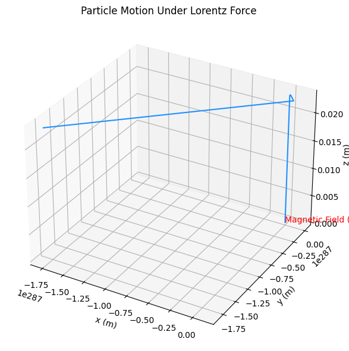

# Problem 1
# 🚀 Simulating the Effects of the Lorentz Force

## 🎯 Motivation

The Lorentz force governs the motion of charged particles in electric and magnetic fields:

$$
\vec{F} = q(\vec{E} + \vec{v} \times \vec{B})
$$

This principle is essential in:

- Particle accelerators  
- Mass spectrometers  
- Magnetic confinement (fusion)  
- Astrophysical phenomena

Simulating the Lorentz force helps visualize the trajectories and understand these effects better.

---





## 🔬 1. Applications

- **Cyclotrons / Synchrotrons** – use $\vec{B}$ to bend particle paths
- **Mass spectrometry** – uses $\vec{E}$ and $\vec{B}$ to identify particles
- **Plasma confinement** – charged particles spiral in magnetic fields
- **Auroras & cosmic rays** – natural demonstrations of Lorentz force

---

## 🧮 2. Python Simulation Code

```python
import numpy as np
import matplotlib.pyplot as plt
from mpl_toolkits.mplot3d import Axes3D

# Lorentz force definition
def lorentz_force(q, v, E, B):
    return q * (E + np.cross(v, B))

# Runge-Kutta 4th order integration
def rk4_step(pos, vel, q, m, E, B, dt):
    def acceleration(v): return lorentz_force(q, v, E, B) / m

    k1v = acceleration(vel) * dt
    k1x = vel * dt

    k2v = acceleration(vel + 0.5 * k1v) * dt
    k2x = (vel + 0.5 * k1v) * dt

    k3v = acceleration(vel + 0.5 * k2v) * dt
    k3x = (vel + 0.5 * k2v) * dt

    k4v = acceleration(vel + k3v) * dt
    k4x = (vel + k3v) * dt

    new_vel = vel + (k1v + 2*k2v + 2*k3v + k4v) / 6
    new_pos = pos + (k1x + 2*k2x + 2*k3x + k4x) / 6

    return new_pos, new_vel

# Simulation function
def simulate(q, m, E, B, v0, r0, t_max, dt):
    steps = int(t_max / dt)
    r = np.zeros((steps, 3))
    v = np.zeros((steps, 3))
    r[0], v[0] = r0, v0

    for i in range(1, steps):
        r[i], v[i] = rk4_step(r[i-1], v[i-1], q, m, E, B, dt)
    return r
```
