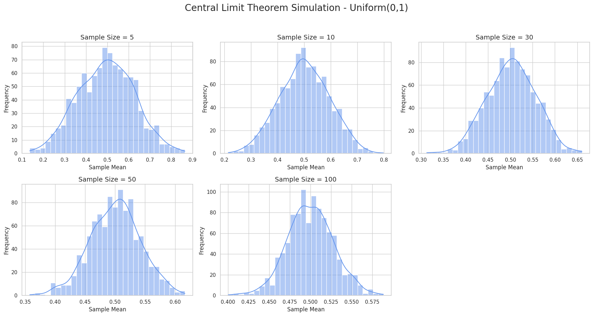

# Problem 1
# 📊 Central Limit Theorem (CLT) — Simulation & Explanation

## 🎯 Motivation

The **Central Limit Theorem (CLT)** is a fundamental concept in statistics. It explains **why normal distributions appear so frequently** in nature and data analysis — even when the original population is not normal.

---

## 📐 What is the Central Limit Theorem?

Suppose we have a population with:

- Mean: $$ \mu $$
- Standard deviation: $$ \sigma $$
- Any arbitrary distribution (not necessarily normal)

Let $$ X_1, X_2, \dots, X_n $$ be independent and identically distributed (i.i.d.) random variables drawn from this population. Define the sample mean:

$$
\bar{X}_n = \frac{1}{n} \sum_{i=1}^n X_i
$$

Then as the sample size $$ n \to \infty $$, the distribution of $$ \bar{X}_n $$ approaches a **normal distribution**, regardless of the shape of the original population:

$$
\bar{X}_n \overset{d}{\longrightarrow} \mathcal{N} \left( \mu, \frac{\sigma^2}{n} \right)
$$

If we **standardize** the sample mean:

$$
Z = \frac{\bar{X}_n - \mu}{\sigma / \sqrt{n}} \Rightarrow Z \sim \mathcal{N}(0, 1)
$$

---

## 🧪 Goal: Simulate CLT with Different Populations

We'll simulate this phenomenon using Python and visualize how the sampling distribution of the mean becomes more normal as:

- Sample size increases
- Distribution changes (uniform, exponential, binomial)



---

## 🧰 Step 1: Create Population Distributions

We simulate large populations from three distributions:

- **Uniform(0, 1)**
- **Exponential(λ = 1)**
- **Binomial(n = 10, p = 0.5)**

```python
import numpy as np
import matplotlib.pyplot as plt
import seaborn as sns
import pandas as pd

np.random.seed(42)
population_size = 100000

# Populations
uniform_pop = np.random.uniform(0, 1, population_size)
exponential_pop = np.random.exponential(1.0, population_size)
binomial_pop = np.random.binomial(10, 0.5, population_size)

populations = {
    "Uniform(0,1)": uniform_pop,
    "Exponential(λ=1)": exponential_pop,
    "Binomial(n=10, p=0.5)": binomial_pop
}
