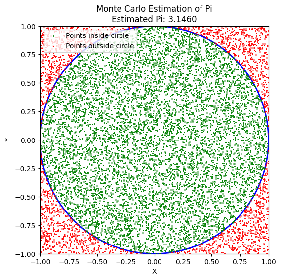

# Problem 2
# Estimating Pi using Monte Carlo Methods

## Motivation:
Monte Carlo simulations are computational techniques that use randomness to solve problems or estimate values. A fascinating application of this is estimating the value of $\pi$ using geometric probability. By randomly generating points and analyzing their positions relative to a geometric shape, we can approximate $\pi$ in a simple yet elegant way.

This task connects concepts of probability, geometry, and numerical computation, showcasing how randomness can be leveraged for solving complex problems in physics, finance, and computer science.

---

## Part 1: Estimating $\pi$ Using a Circle

### 1. Theoretical Foundation:

The idea behind estimating $\pi$ using a Monte Carlo method is based on geometry. Consider a unit circle inscribed inside a square. The ratio of the area of the circle to the area of the square is proportional to $\pi$. 

For a unit circle, the area is:

$$
A_{\text{circle}} = \pi r^2 = \pi
$$

The area of the square (with side length 2) is:

$$
A_{\text{square}} = 4
$$

Thus, the ratio of the areas is:

$$
\frac{A_{\text{circle}}}{A_{\text{square}}} = \frac{\pi}{4}
$$

By randomly generating points in the square and counting how many fall inside the circle, we can estimate $\pi$. Specifically, the ratio of points inside the circle to the total number of points is approximately equal to the ratio of areas:

$$
\frac{\text{Points inside the circle}}{\text{Total points}} \approx \frac{\pi}{4}
$$

Therefore, we can estimate $\pi$ by:

$$
\pi \approx 4 \times \frac{\text{Points inside the circle}}{\text{Total points}}
$$




### 2. Simulation:

Let’s generate random points inside a 2D square with a unit circle inscribed in it. For each point, we check if it lies inside the circle, and based on the ratio, we estimate the value of $\pi$.

```python
import numpy as np
import matplotlib.pyplot as plt

# Function to estimate pi using Monte Carlo method
def estimate_pi_circle(n_points):
    points = np.random.rand(n_points, 2) * 2 - 1  # Random points in a square (-1, 1)
    inside_circle = np.sum(np.linalg.norm(points, axis=1) <= 1)  # Check if points are inside the unit circle
    pi_estimate = 4 * inside_circle / n_points
    return pi_estimate, points, inside_circle

# Number of random points to generate
n_points = 10000
pi_estimate, points, inside_circle = estimate_pi_circle(n_points)

# Plotting the points
fig, ax = plt.subplots()
ax.set_aspect('equal')
circle = plt.Circle((0, 0), 1, color='blue', fill=False, linewidth=2)  # Unit circle
ax.add_artist(circle)
ax.scatter(points[:,0], points[:,1], c='red', s=1, label="Points")
ax.set_xlim([-1, 1])
ax.set_ylim([-1, 1])
ax.set_title(f"Estimate of Pi: {pi_estimate}")
ax.legend()
plt.show()

print(f"Estimated Pi: {pi_estimate}")
```