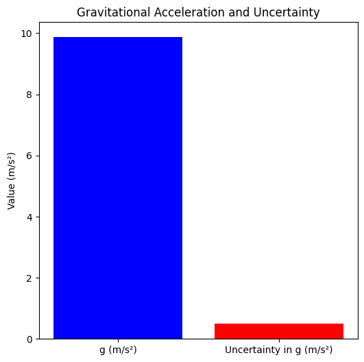
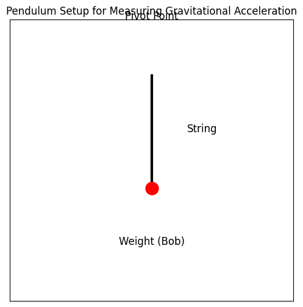
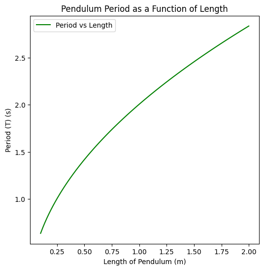

# Problem 1
# Measuring Earth's Gravitational Acceleration with a Pendulum

## Motivation:
The acceleration $$g$$ due to gravity is a fundamental constant that influences a wide range of physical phenomena. Measuring $$g$$ accurately is crucial for understanding gravitational interactions, designing structures, and conducting experiments in various fields. One classic method for determining $$g$$ is through the oscillations of a simple pendulum, where the period of oscillation depends on the local gravitational field.

## Task:
Measure the acceleration $$g$$ due to gravity using a pendulum and analyze the uncertainties in the measurements.

This exercise emphasizes rigorous measurement practices, uncertainty analysis, and their role in experimental physics.




## Procedure:

### 1. Materials:
- A string (1 or 1.5 meters long).
- A small weight (e.g., bag of coins, bag of sugar, key chain) mounted on the string.
- Stopwatch (or smartphone timer).
- Ruler or measuring tape.

### 2. Setup:
- Attach the weight to the string and fix the other end to a sturdy support.
- Measure the length of the pendulum, $$L$$, from the suspension point to the center of the weight using a ruler or measuring tape. Record the resolution of the measuring tool and calculate the uncertainty as half the resolution $$\Delta L = \frac{1}{2} \times \text{resolution}$$.




### 3. Data Collection:
- Displace the pendulum slightly (<15°) and release it.
- Measure the time for 10 full oscillations ($$T_{10}$$) and repeat this process 10 times. Record all 10 measurements.
- Calculate the mean time for 10 oscillations ($$T_{mean}$$) and the standard deviation ($$\sigma_T$$).
- Determine the uncertainty in the mean time as:
  
  $$\Delta T_{mean} = \frac{\sigma_T}{\sqrt{n}}$$
  
  where $$n$$ is the number of measurements.

## Calculations:

### 1. Calculate the Period:
- The period of a pendulum is given by the formula:
  
  $$
  T = 2\pi \sqrt{\frac{L}{g}}
  $$

  From the measured $$T_{mean}$$, we can rearrange this to solve for the acceleration due to gravity:
  
  $$
  g = \frac{4\pi^2 L}{T^2}
  $$


````
import numpy as np

# Given values
L = 1.0  # Length of the pendulum in meters
T_mean = 2.0  # Measured mean period in seconds (for example)
```
# Calculate gravitational acceleration
g = (4 * np.pi**2 * L) / T_mean**2
print(f"Estimated gravitational acceleration g: {g} m/s²")

